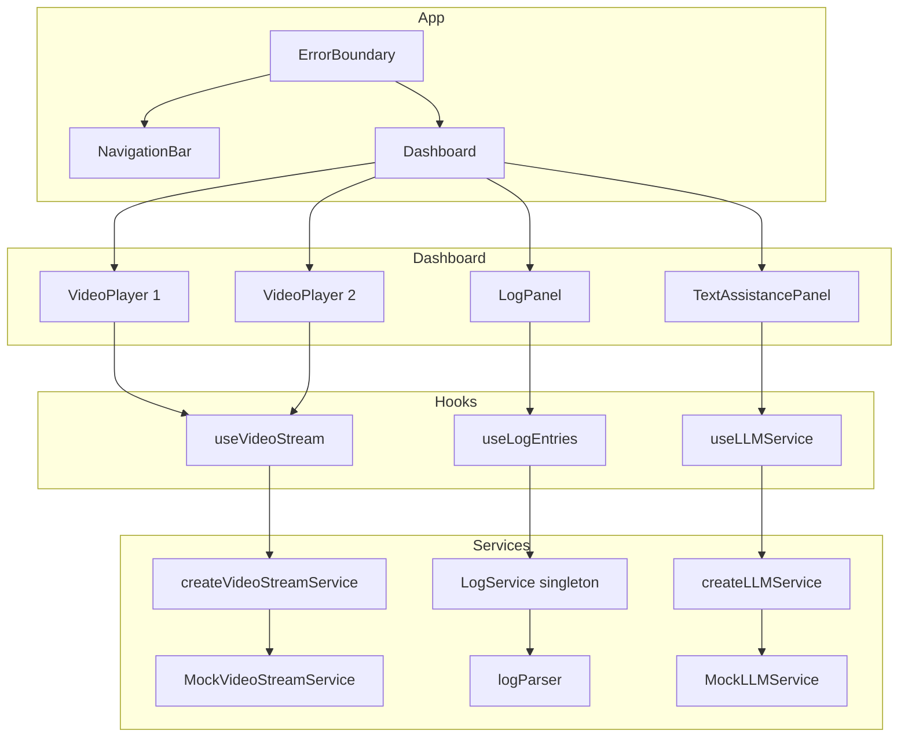
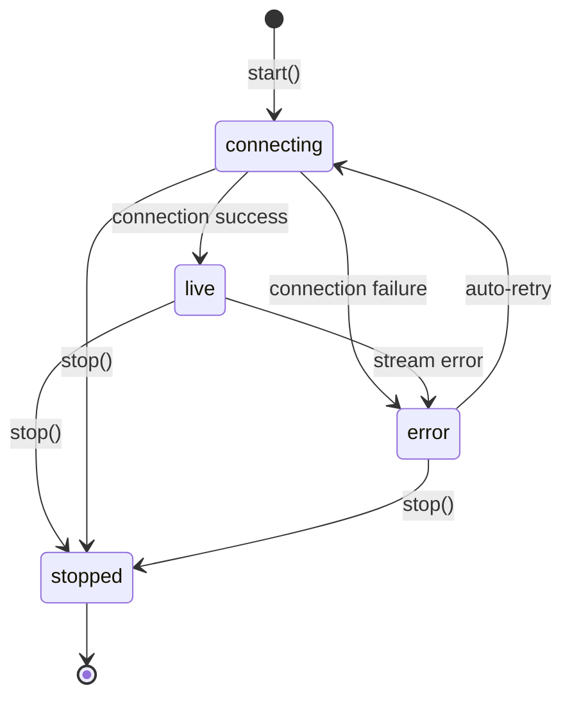

# Design: Video Feed Dashboard

## Overview

The Video Feed Dashboard is a single-page React application that displays two live video feeds side-by-side, a scrollable log panel, and an LLM-powered text assistance chat panel. The application is built with React 18, TypeScript, and Tailwind CSS, bundled with Vite.

All external dependencies (video streams, LLM APIs) are abstracted behind typed TypeScript interfaces. Mock implementations are provided for development and testing, allowing real backends to be swapped in without changing UI code.

### Key Design Decisions

- **Interface-first architecture**: Video stream and LLM services are defined as TypeScript interfaces. Concrete implementations (mock or real) are created via factory functions, enabling dependency inversion.
- **Hook-based state management**: Each panel manages its own state through custom React hooks (`useVideoStream`, `useLLMService`, `useLogEntries`). No global state store is needed — the dashboard is a composition of independent panels.
- **Pub/sub log service**: A singleton `LogService` uses a publish/subscribe pattern so any part of the application can emit log entries and the log panel receives them reactively.
- **Tailwind CSS with dark mode**: Styling uses Tailwind utility classes with `media`-based dark mode, keeping the design minimal and modern.

## Architecture



### Data Flow

1. **Video feeds**: Each `VideoPlayer` component calls `useVideoStream(config)`. The hook creates a `VideoStreamService` via the factory, subscribes to frame and status callbacks, and exposes `{ status, frameSrc, start, stop }`. Frames are rendered as `` elements from data URLs.

2. **Log panel**: The `LogService` singleton accepts `log(entry)` calls from anywhere (e.g., video stream lifecycle events). `useLogEntries` subscribes to the service and accumulates entries in local state. `LogPanel` renders them with `formatLogEntry`.

3. **Text assistance**: `useLLMService(config)` creates an `LLMService` via the factory, manages a `ChatMessage[]` history in state, and exposes `{ messages, sendMessage, isLoading }`. `TextAssistancePanel` renders the conversation and input field.

### Responsive Layout

```
┌──────────────────────────────────────────┐
│              NavigationBar               │
├────────────────────┬─────────────────────┤
│                    │                     │
│   VideoPlayer 1    │   VideoPlayer 2     │
│   (larger)         │   (smaller)         │
│                    │                     │
├────────────────────┬─────────────────────┤
│                    │                     │
│    LogPanel        │ TextAssistancePanel  │
│                    │                     │
└────────────────────┴─────────────────────┘
```

Above 768px: side-by-side layout with the left video feed larger. Below 768px: all panels stack vertically.

## Components and Interfaces

### Service Interfaces

#### VideoStreamService

```typescript
type StreamStatus = "connecting" | "live" | "error" | "stopped";
type StreamSourceType = "mock" | "mjpeg" | "websocket" | "webrtc";

interface StreamSourceConfig {
  sourceType: StreamSourceType;
  url?: string;
  options?: Record<string, unknown>;
}

type FrameHandler = (frameSrc: string) => void;

interface VideoStreamService {
  start(): void;
  stop(): void;
  onFrame(handler: FrameHandler): void;
  onStatusChange(handler: (status: StreamStatus) => void): void;
  getStatus(): StreamStatus;
}
```

#### LLMService

```typescript
interface LLMServiceConfig {
  type: "mock" | "openai" | "anthropic";
  endpoint?: string;
  options?: Record<string, unknown>;
}

interface ChatMessage {
  role: "user" | "assistant";
  content: string;
  timestamp: Date;
}

interface LLMService {
  sendMessage(message: string): Promise<ChatMessage>;
}
```

#### LogService

```typescript
type LogLevel = "info" | "warn" | "error" | "debug";

interface LogEntry {
  timestamp: Date;
  level: LogLevel;
  message: string;
}

interface FormattedLogEntry {
  timestamp: Date;
  level: LogLevel;
  message: string;
  formatted: string;
}
```

### Factory Functions

- `createVideoStreamService(config: StreamSourceConfig): VideoStreamService` — returns `MockVideoStreamService` for `sourceType: "mock"`, throws for unsupported types.
- `createLLMService(config: LLMServiceConfig): LLMService` — returns `MockLLMService` for `type: "mock"`.

### React Hooks

| Hook | Input | Output | Responsibility |
|------|-------|--------|----------------|
| `useVideoStream` | `StreamSourceConfig` | `{ status, frameSrc, start, stop }` | Creates/manages stream service lifecycle, cleans up on unmount |
| `useLLMService` | `LLMServiceConfig` | `{ messages, sendMessage, isLoading }` | Creates LLM service, manages chat history, cancels on unmount |
| `useLogEntries` | none | `{ entries: LogEntry[] }` | Subscribes to LogService singleton, accumulates entries |

### UI Components

| Component | Props | Description |
|-----------|-------|-------------|
| `App` | none | Root component, renders NavigationBar + ErrorBoundary wrapping Dashboard |
| `NavigationBar` | `{ title: string }` | Fixed top bar with application title, dark mode support |
| `Dashboard` | none | Responsive grid layout composing all four panels |
| `VideoPlayer` | `{ title: string, streamConfig: StreamSourceConfig }` | Displays video frames, status indicator, error/loading states |
| `LogPanel` | none | Scrollable timestamped log entries with auto-scroll |
| `TextAssistancePanel` | none | Chat interface with message history, input field, loading indicator |

## Data Models

### Stream State Machine



The `MockVideoStreamService` simulates this state machine:
- Starts in `connecting`, transitions to `live` after a configurable delay
- Produces animated canvas frames at regular intervals while `live`
- Periodically simulates errors and auto-retries after a configurable delay
- Logs lifecycle events (connection, disconnection, error, retry) via console

### Chat Message Model

```typescript
// Messages are stored in an ordered array in useLLMService state
ChatMessage[] = [
  { role: "user", content: "Hello", timestamp: Date },
  { role: "assistant", content: "Hi there!", timestamp: Date },
  // ...
]
```

User messages are added to state immediately on submit. Assistant messages are appended when the LLM service responds.

### Log Entry Format

Log entries follow a consistent text format for display:

```
[YYYY-MM-DD HH:mm:ss] [LEVEL] message
```

The `logParser` module provides three functions:
- `parseLogEntry(entry: LogEntry): FormattedLogEntry` — adds the `formatted` string
- `formatLogEntry(entry: LogEntry): string` — produces the formatted string
- `parseFormattedLogEntry(formatted: string): LogEntry` — parses the string back to a LogEntry


## Correctness Properties

*A property is a characteristic or behavior that should hold true across all valid executions of a system — essentially, a formal statement about what the system should do. Properties serve as the bridge between human-readable specifications and machine-verifiable correctness guarantees.*

### Property 1: parseLogEntry extracts correct fields

*For any* valid `LogEntry` object (with a random `Date`, a random `LogLevel` from `["info", "warn", "error", "debug"]`, and a random non-empty string message), calling `parseLogEntry` SHALL produce a `FormattedLogEntry` whose `timestamp`, `level`, and `message` fields match the original input.

**Validates: Requirements 13.1**

### Property 2: Log entry format round-trip

*For any* valid `LogEntry` object, calling `formatLogEntry` then `parseFormattedLogEntry` SHALL produce a `LogEntry` equivalent to the original (with timestamp compared to second precision, same level, same message). Additionally, the intermediate formatted string SHALL match the pattern `[YYYY-MM-DD HH:mm:ss] [LEVEL] message`.

**Validates: Requirements 13.2, 13.3**

## Error Handling

### Video Stream Errors

- **Connection failure**: `MockVideoStreamService` transitions to `"error"` status. The `VideoPlayer` component renders an error fallback UI. The service automatically retries after a configurable delay, transitioning back to `"connecting"`.
- **Stream interruption**: While `"live"`, periodic simulated errors trigger the same error → retry cycle.
- **Cleanup on unmount**: `useVideoStream` calls `stop()` on the service when the component unmounts, clearing all intervals and removing listeners to prevent memory leaks.

### LLM Service Errors

- **Request failure**: `MockLLMService` returns canned responses, so errors are unlikely in mock mode. Real implementations should catch network errors and surface them in the UI.
- **Unmount during request**: `useLLMService` uses a cancelled flag to prevent state updates after unmount, avoiding React warnings.

### Log Parser Errors

- **Malformed LogEntry input**: `parseLogEntry` throws a `TypeError` for invalid input (missing fields, wrong types).
- **Malformed formatted string**: `parseFormattedLogEntry` throws a descriptive error if the string doesn't match the expected `[YYYY-MM-DD HH:mm:ss] [LEVEL] message` pattern.

### Application-Level Errors

- **Error Boundary**: The `App` component wraps `Dashboard` in a React Error Boundary. If any child component throws during rendering, the boundary catches it and displays a fallback UI with a reload button.

## Testing Strategy

### Dual Testing Approach

The project uses both unit tests and property-based tests for comprehensive coverage:

- **Unit tests** (Vitest + React Testing Library): Verify specific examples, edge cases, UI rendering, component interactions, and hook lifecycle behavior.
- **Property-based tests** (fast-check): Verify universal properties of the log parser functions across many generated inputs.

### Property-Based Testing

PBT is applicable to the log parsing module (`logParser.ts`) because it contains pure functions with clear input/output behavior and a natural round-trip property (format → parse).

PBT is NOT applicable to the remaining feature areas:
- **UI components**: React component rendering is best tested with example-based snapshot/interaction tests.
- **Mock services**: These simulate behavior with fixed logic — input variation doesn't reveal meaningful edge cases.
- **Hooks**: Lifecycle and state management are tested with specific mount/unmount scenarios.

**Configuration:**
- Library: `fast-check` (already installed)
- Minimum 100 iterations per property test
- Each property test tagged with: `Feature: video-feed-dashboard, Property {number}: {property_text}`

**Property test files:**
- `src/__tests__/properties/logParser.property.test.ts`

### Unit Test Coverage

| Area | Test File | What's Tested |
|------|-----------|---------------|
| Log parser | `src/__tests__/services/logParser.test.ts` | parseLogEntry with valid/invalid input, formatLogEntry output format, parseFormattedLogEntry with valid/invalid strings |
| LogService | `src/__tests__/services/LogService.test.ts` | Subscribe/unsubscribe, entry publishing, multiple subscribers |
| MockVideoStreamService | `src/__tests__/services/MockVideoStreamService.test.ts` | Status transitions, frame production, error/retry cycle, cleanup |
| MockLLMService | `src/__tests__/services/MockLLMService.test.ts` | Response after delay, configuration acceptance |
| useVideoStream | `src/__tests__/hooks/useVideoStream.test.ts` | Return shape, cleanup on unmount, status reflection |
| useLLMService | `src/__tests__/hooks/useLLMService.test.ts` | Return shape, message history, cleanup on unmount |
| useLogEntries | `src/__tests__/hooks/useLogEntries.test.ts` | Subscribe on mount, unsubscribe on unmount, entry accumulation |
| NavigationBar | `src/__tests__/components/NavigationBar.test.ts` | Title rendering, fixed positioning classes |
| VideoPlayer | `src/__tests__/components/VideoPlayer.test.ts` | UI for each status, title display |
| LogPanel | `src/__tests__/components/LogPanel.test.ts` | Entry rendering with timestamps, auto-scroll, title |
| TextAssistancePanel | `src/__tests__/components/TextAssistancePanel.test.ts` | Message history, input field, send button, immediate user message display |
| Dashboard | `src/__tests__/components/Dashboard.test.ts` | All four panels rendered, responsive layout classes |

### Test Runner

- **Vitest** with jsdom environment (configured in `vite.config.ts`)
- Run all tests: `npm test` (executes `vitest --run`)
